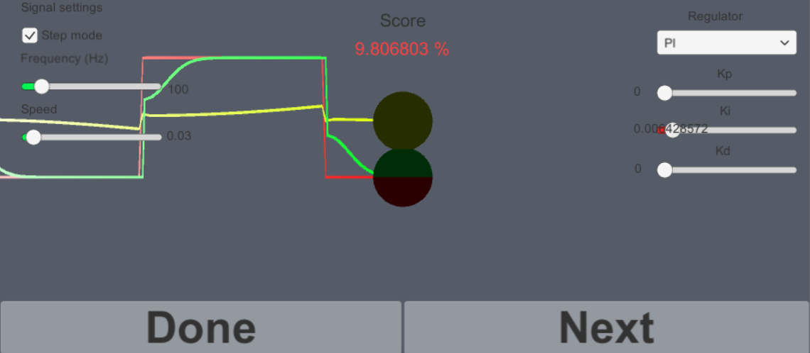

# regulator_simulation
Simulation of P, PD, PI and PID Regulators in unity 3d. Can be used to test regulator outputs depending on insignal and variable values.
See screenshot below! Green is regulator result, Yellow is goal/wanted and red is the input signal. Notice the score which basicly descibes the difference in values between goal and regulator over one pulse in percentage.

# Runnables
I created runnables for windows.

 - Game.exe contains the a small regulator game where the goal is to choose a regulator with the wanted output.
 - Regulator_sim.exe is a regulator simulation.

# Helpful code 
https://gist.github.com/bradley219/5373998

# Known issues

1. To avoid divide by 0 error. We skip 0 values, resulting in weird regulator/goal sometimes.
2. Some values on regulator can get outofbounds and then cause an error. To continue just press next.

